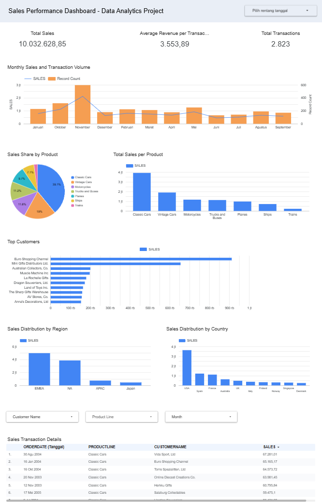

# Sales Data Warehouse Project

This project is an end-to-end data analytics workflow: from data cleaning, EDA, to dashboard creation.

## 📌 Objective
To analyze sales performance by product line, customer, and region using Python & Looker Studio.

## 📁 Dataset
- Source: [Sales Daataset on Kagglep](https://www.kaggle.com/datasets/kyanyoga/sample-sales-data/data) 
- Raw CSV: `dataset/sales_dataset.csv`
- Cleaned CSV: `dataset/cleaned_sales_dataset.csv`

## 🧪 Data Cleaning & EDA
Performed in Google Colab using Python:
- Handled missing values and blank strings
- Aggregated sales by key dimensions (product line, customer, etc.)
- Exploratory Data Analysis using grouping and visualizations

🔗 [Google Colab Notebook](https://colab.research.google.com/drive/1jiFNviJ0QoQWkM1z-5-EoIpRIflPw9Hh?usp=sharing)

## 📊 Interactive Dashboard
Created using Looker Studio:
- Total Sales by Product Line
- Average Sales per Product Line
- Monthly Sales and Transaction Volume
- Top Customers by Number of Transactions
- Sales by Territory
- Sales by Country
 
🔗 [Looker Studio Dashboard](https://lookerstudio.google.com/reporting/2e504976-0419-42a3-854a-b360ae9dd91f)

## 🖼️ Dashboard Preview

## 🧰 Tools Used
- **Python**: Data cleaning and analysis with Pandas, visualization with Matplotlib
- **Google Colab**: Cloud-based development and exploration
- **Looker Studio**: Interactive dashboard for insights sharing
- **GitHub**: Project version control and documentation

## 📈 Key Insights
- Classic Cars is the highest-performing product line in terms of total and average sales.
- USA is the top-selling country, followed by France and Spain.
- EMEA region contributes the most revenue across all territories.
- A few key customers dominate the sales volume, indicating potential for segmentation strategies.
